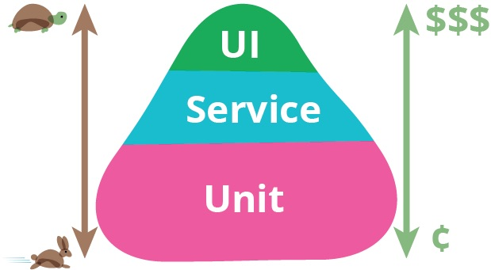
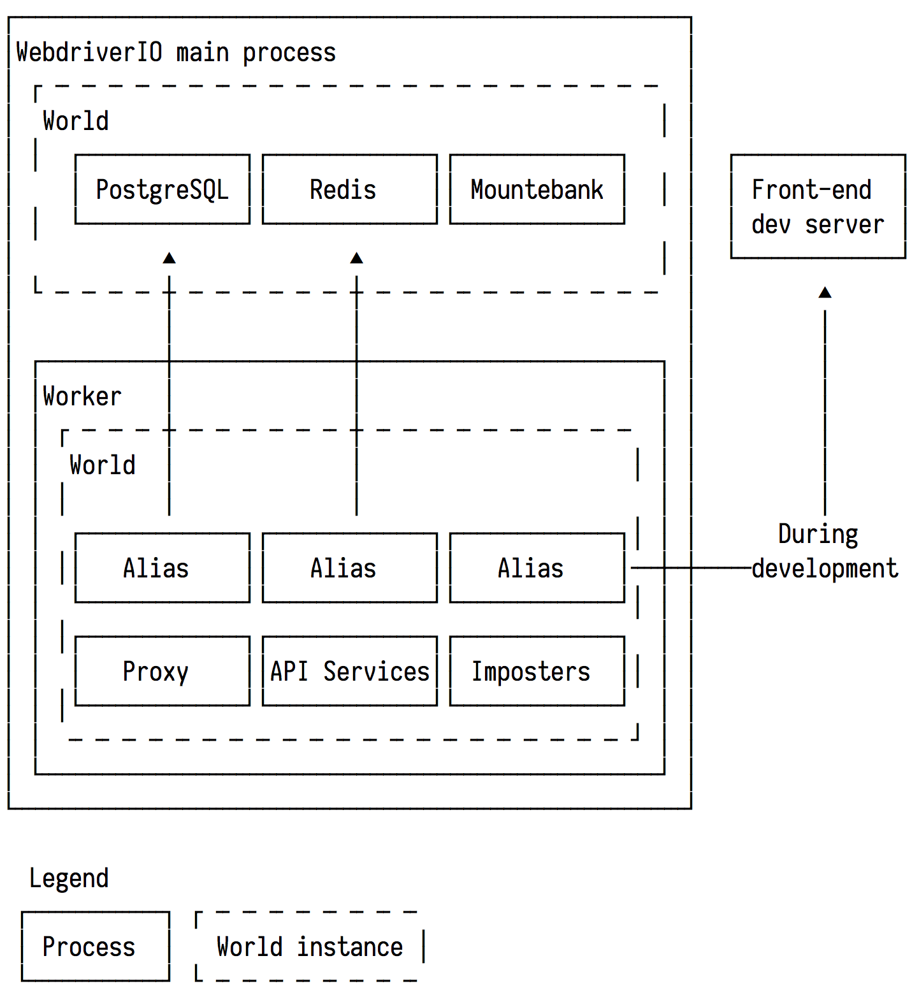

theme: Simple, 2
autoscale: true

# End-to-end Testing
## A lower cost approach explained

---

# Definition

>"End-to-end testing is a technique used to test whether the flow of an application right from start to finish is behaving as expected."
-- [What is End-to-End Testing?][definition] - TutorialsPoint

---

# Benefits

- Assume a user's perspective to more realistically test that an application correctly performs business operations
- Test that the application works across multiple environments
  - Device: Desktop, mobile
  - Browser type: Chrome, Firefox, Safari, Edge, Internet Explorer
  - Settings: Private browsing / Incognito, JavaScript disabled
  - Network speed: 2G, 3G, 4G
- Automated accessibility testing!

---

# Issues and difficulties

- Tests are sensitive to changes in the UI which occur often e.g change button text.
- Require a great deal of orchestration. We have to spin up services or stub/mock entire services.
- They can take a long time to run.
- All in all, end-to-end tests are more expensive than smaller unit tests

>
-- [TestPyramid](https://martinfowler.com/bliki/TestPyramid.html) - Martin Fowler

---

# :fire: Opinion

Test harnesses are not treated with the same care as the systems they exercise.

They are not planned out and designed like production systems. Yet, we expect test harnesses to give us guarantees about code going into production!

Let's explore some ideas to build a reliable end-to-end test harness.

---

# Guidelines

A successful test harness must be:

- Written in the view of a user performing a business function
- Exercising as much production code as possible
- Easy to extend with more tests
- Parallelizable i.e. many tests can run at once
- Allow simple orchestration of services
- Reliable e.g. tolerate trivial changes to markup (presentation)

---

# Tooling - Cucumber

[Cucumber][cucumber] is a specification language that can be transformed into tests:

```gherkin
Feature: Sign up
  Scenario: Valid details
    Given I open the page "/"

    When I click the button with text "Sign up"
    And I fill the form with:
      | label | value |
      | Name | George Haidar |
      | Email | ghaidar0@gmail.com |
      | Password | correct-horse-battery-staple |
    And I click the button with text "Submit"

    Then I expect that the title is "TodoApp | Welcome to TodoApp"
```

It allows writing test steps in english and requires developers to implement these steps using browser/application automation libraries.

---

# Tips - Cucumber

- `Given` steps are used for setup
- `When` steps are used for performing actions
- `Then` steps are for checking results
- Implement a small set of useful steps and document them in a README. These should be useful across all test scenarios and even across websites and applications.
- It's best to target interactive elements by text/label
  
  ```gherkin
  # Good
  When I click the button with text "Sign up"
  # Bad
  When I click the button with selector "form.signup > button[type=submit]"
  ```

---

# Tooling - WebdriverIO

[WebdriverIO][webdriverio] is library that provides Selenium 2.0 bindings for NodeJS. It is used for performing actions in a web browser e.g. go to a page, click a button, read page title.

```javascript
const signUp = async () => {
  await browser.url('/').click('//button[string()="Sign up"])

  const emailFieldID = await browser
    .getAttribute('//label[string()="Email"]', "for").then(r => r.value)

  await browser.setValue(`#${emailFieldID}`, 'testuser@example.com')

  return browser.click('//button[string()="Submit"])
}
```

Synchronous support is available through `node-fibers` but we have async-await!

---

# Tips - WebdriverIO

- browser.debug() in step code is a life-saver
- Use [`visionmedia/debug`](https://github.com/visionmedia/debug) to add debug logging
  - Stands out more than `browser.logger`
  - Useful in places where browser object is not available e.g. `wdio.conf.js`
  - Can be controlled with `DEBUG` envionment variable
- Create handy utility functions for common tasks e.g. registerUser() and login()
- `browser` object is shared by all scenarios of a cucumber feature.
  - WebdriverIO launches a child process for each feature - NOT each scenario

---

# Tooling - Mountebank

[Mountebank](http://www.mbtest.org/) is a tool to provide cross-platform, multi-protocol test doubles over the wire.

It allows us to replace any HTTP-based service with an imposter which we can control to respond in specific ways to requests.

```sh
curl -XPOST http://localhost:2525/imposters -d @- << EOF
{
  "name": "EmailService",
  "protocol": "http",
  "port": 9000,
  "stubs": [
    {
      "predicates": [ { "equals": { "method": "POST", "path": "/email" } } ],
      "responses": [
        {
          "is": {
            "statusCode": 200,
            "body": { "byteCount": 888 }
          }
        }
      ]
    }
  ]
}
EOF
```

---

# Tooling - Mountebank (cont.)

Run some requests through the imposter and then:

```bash
curl http://localhost:2525/imposters/9000
```

```json
{
  "protocol": "http",
  "port": 9000,
  "numberOfRequests": 1,
  "name": "EmailService_Send",
  "requests": [
    {
      "requestFrom": "::ffff:127.0.0.1:60945",
      "method": "POST",
      "path": "/email",
      "query": {},
      "headers": {
        "Content-Type": "text/plain; charset=utf-8",
        "Host": "localhost:9000",
        "Connection": "close",
        "User-Agent": "Paw/3.1.1 (Macintosh; OS X/10.12.4) GCDHTTPRequest",
        "Content-Length": "84"
      },
      "body": "{\n  \"subject\": \"Hello George\",\n  \"body\": \"This email is getting mocked, isn't it?\"\n}",
      "timestamp": "2017-05-01T22:56:40.482Z"
    }
  ],
  "stubs": [],
  "_links": { "self": { "href": "http://localhost:2525/imposters/9000" } }
}
```

---

# Tips

- `mb --mock` records all requests that mountebank caught. Useful for debugging.
- Don't assign explicit ports to imposters and Mountebank will assign and return a port in the imposter result. Allows for parallel creation of imposters.

---

# Tooling - TypeScript

[TypeScript](https://www.typescriptlang.org/) is a typed superset of JavaScript that compiles to plain JavaScript.

```typescript
interface APIClient<T> {
  get(url: string): Promise<T>
  post(url: string, body: object): Promise<T>
}
interface JSONAPIResponse {
  data: {
    attributes: { [k: string]: any }
  }
}
const makeClient = (): APIClient<JSONAPIResponse> => {
  return {
    get: async (url: string) => (await fetch(url)).json() as Promise<JSONAPIResponse>,
    post: async (url: string, body: object) => {
      const res = await fetch(url, {
        method: 'POST',
        body: JSON.stringify(body),
        headers: { 'Content-Type': 'application/vnd.api+json' }
      });
      return res.json() as Promise<JSONAPIResponse>
    }
  }
}
```

---

# Tips - TypeScript

- TypeScript is incredibly useful for designing and documenting all the utility code in the test harness.
- Communicate `interfaces` between modules instead of concrete types.
- Use [tslint](https://palantir.github.io/tslint/) to maintain a consistent coding style.
- async-await is available!

---

# Tooling - Other

- [execa](https://github.com/sindresorhus/execa) - nice API for working with child processes
- [axe-core](https://github.com/dequelabs/axe-core) - accessibility engine for automated Web UI testing
- [Chance](http://chancejs.com/) - generates random data (emails, phones, etc...)
- [portfinder](https://github.com/indexzero/node-portfinder) - find an open port to use when creating services
- [p-retry](https://github.com/sindresorhus/p-retry) - Retry a promise-returning function e.g. health check

---

# Deep dive

Let's build this thing.

- Define services
- Define a `World` that stores context including running services and imposters
- Implement steps
- Write reliable tests!

---

# Defining services

Services comprising the test environment are defined as follows:

```typescript
interface Service {
  name: string;
  location: ServiceLocation;
  isHealthy: () => Promise<boolean>;
  stop: () => Promise<void>;
}

interface ServiceLocation {
  auth?: string;
  hostname: string;
  port?: string;
  protocol: string;
  slashes?: boolean;
  query?: {
    [name: string]: any,
  };
}
```

---

# Defining a World

A `World` contains useful contextual information and methods for creating services.

An instance is created in the main WebdriverIO process to host global services and an instance is created before every test scenario to host local services.

```typescript
interface World {
  createService(factory: (port: string) => Promise<Service>): Promise<Service>;
  stopService(service: Service): Promise<void>;
  registerImposter(name: string, definitionFile: string): Promise<Service>;
  getContext(): Promise<Context>;

  getIdentityCredentials(): Promise<Credentials>;
}
```

---

# Orchestration view



---

# Implement cucumber steps

```typescript
// src/cucumber/actions/enterRandomEmail.ts

async function enterRandomEmail(labelSelector: string) {
  const world = this as World;
  const { email } = await world.getIdentityCredentials();
  const id = await browser
    .getAttribute(`//label[text()='${labelSelector}']`, 'for')
    .then((v) => v);

  return browser.setValue(`#${id}`, email)
}

export default enterRandomEmail;
```

```typescript
// src/cucumber/steps/when.ts

import { StepDefinitions } from 'cucumber';
import enterEmail from '../actions/enterRandomEmail';

function StepsWhen() {
  const { When } = this as StepDefinitions;
  When(/^I enter an email for field "([^"]*)?"$/, enterRandomEmail);
}
```

---

# Write reliable tests!

```gherkin
Feature: Registration
  Scenario: New user
    Given An environment:
      | name | type | location |
      | email | imposter | ../common/imposters/email.json |
      | sms | imposter | ../common/imposters/sms.json |
    And I open the page "/"

    When I click the link with text "Continue"
    Then I expect that the title is "Govpass | How Govpass works"

    When I select the radio button for "Yes, I agree"
    And I click the button with text "Continue"
    Then I expect that the title is "Govpass | What you need to create a Govpass"

    When I select the radio button for "Yes, I have these documents"
    And I click the button with text "Next"
    Then I expect that the title is "Govpass | Set up your email"

    When I enter an email for field "Enter email"
    And I click the button with text "Send code"
    Then I expect that the title is "Govpass | Enter code from email"

    When I enter an email passcode for field "Enter email code"
    And I click the button with text "Submit"
    Then I expect that the title is "Govpass | Secure your account"

    When I enter a mobile for field "Enter mobile number"
    And I click the button with text "Send code"
    Then I expect that the title is "Govpass | Enter code from mobile"

    When I enter a mobile passcode for field "Enter the 6-digit code"
    And I click the button with text "Submit"

    Then I expect that the title is "Govpass | Add your identity documents"
```

---

# Profit!

---

# Demo

---

# Thank you


[cucumber]: https://github.com/cucumber/cucumber-js
[definition]: https://www.tutorialspoint.com/software_testing_dictionary/end_to_end_testing.htm
[webdriverio]: http://webdriver.io/
